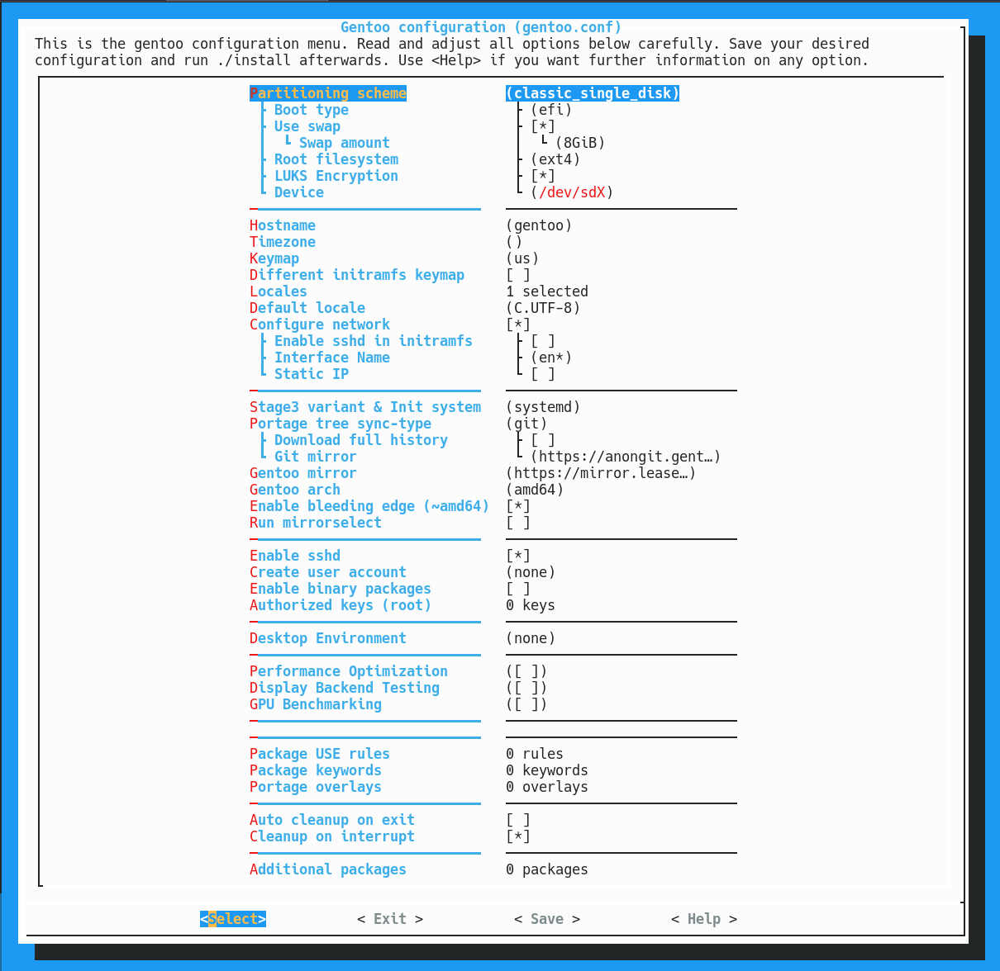
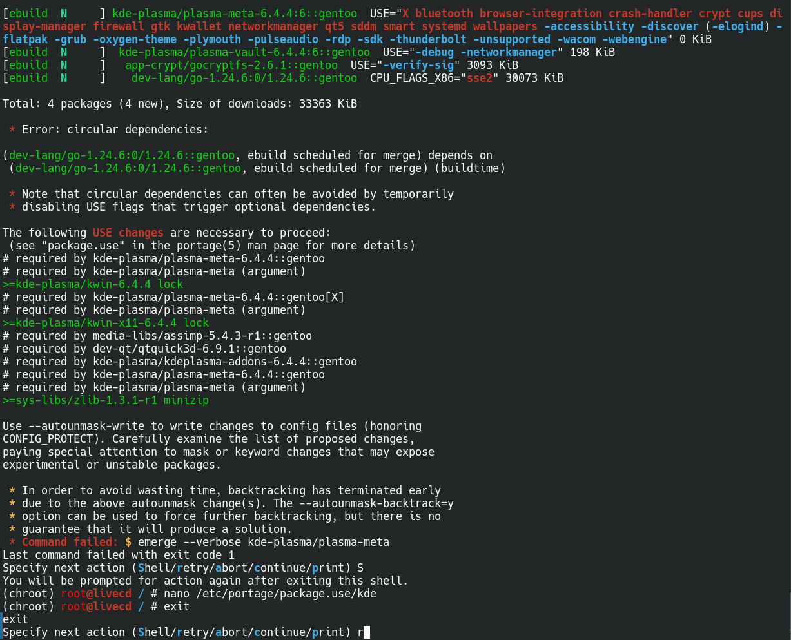

# Gentoo Easy Install

## About Gentoo Easy Install

This project is a fork of [oddlama/gentoo-install](https://github.com/oddlama/gentoo-install) with enhanced features and additional functionality. It aspires to be your favourite way to install Gentoo. It aims to provide a smooth, reliable, and secure installation experience for both beginners and experts. You may configure it by using a menuconfig-inspired interface or simply via a config file.

### 🎯 See It In Action



*The intuitive TUI interface makes Gentoo installation accessible while maintaining full power user control. Every option is explained with detailed help text.*



*When things don't go as planned, the installer provides multiple recovery options. Power users can take manual control at any point, ensuring you're never locked out of your system.*

It supports common disk layouts, various file systems like ext4, ZFS, and Btrfs, and additional layers such as LUKS encryption and mdraid. It robustly supports both **EFI (recommended)** and **BIOS** boot, and can be used with **systemd** or **OpenRC** as the init system.

## 🚀 Latest Improvements

### **Bulletproof Reliability (Latest)**
- **Comprehensive Unbound Variable Protection**: All configuration arrays are proactively initialized, preventing installation failures due to missing variables
- **Universal Compatibility**: Works with any configuration file (old, new, minimal, or complete)
- **Strict Mode Support**: Compatible with `set -u` debugging for better error detection
- **Proactive Error Prevention**: Issues are prevented before they occur, not just handled after

### **Enhanced Desktop Environment Support**
- **Automatic Portage Profile Management**: Correct profiles are automatically set for KDE Plasma, GNOME, and other DEs
- **GURU Overlay Integration**: Automatic GURU overlay management for Hyprland installations
- **Complete Hyprland Ecosystem**: Automatic dependency detection and installation based on user configuration
- **Optimized Package Selection**: Essential packages are always installed, additional packages are configurable

### **Advanced Bootloader Configuration**
- **Platform-Specific Installation**: Automatic UEFI/BIOS detection and appropriate bootloader setup
- **RAID Boot Order Management**: Intelligent UEFI boot order optimization for RAID 1 setups
- **Secure Boot Support**: Optional shim installation and Secure Boot guidance
- **Multiple Bootloader Options**: GRUB, systemd-boot, and EFI Stub support

## Features

  * **User-Friendly TUI**: An easy-to-use terminal interface to configure every aspect of your installation.
  * **Flexible Disk Configuration**: Support for various partitioning schemes including LUKS encryption, software RAID (RAID 0/1), LVM, Btrfs-RAID, and ZFS.
  * **Modern Bootloader Support**: Full support for GRUB, systemd-boot, and direct EFI Stub booting, with automatic detection for UEFI and Secure Boot.
  * **Desktop Environment Support**: Automated installation for popular desktop environments like KDE Plasma, GNOME, XFCE, and more, with optimized configurations.
  * **Enhanced KDE Plasma Integration**: Automatic setup of optimal USE flags, KWallet PAM auto-unlocking, and Polkit rules for a seamless experience.
  * **Hyprland Ecosystem Support**: Complete Wayland compositor installation with automatic GURU overlay management and dependency detection.
  * **Secure by Default**: Includes options for a hardened SSH configuration, interactive password setting (no plaintext passwords in config), and secure system defaults.
  * **Automated and Repeatable**: Create a configuration once and use it for consistent, automated installations.
  * **Robust Error Handling & Cleanup**: The installer can now automatically clean up the environment after an interruption (Ctrl+C) to prevent leaving a broken state.

## 🖥️ TUI Installer Interface

The Gentoo Easy Install provides an intuitive, menu-driven interface that makes configuration simple while maintaining full control for power users.

### 📋 Configuration Interface

**Key Features of the TUI:**
- **Menu-driven navigation** with arrow keys and Enter
- **Comprehensive help system** - press F1 or ? for detailed explanations
- **Real-time validation** of configuration options
- **Save/Load functionality** for configuration files
- **Clear categorization** of related settings
- **Desktop Environment Profiles**: Automatic Portage profile selection for optimal DE functionality

### 🛠️ Power User Control & Error Recovery

**Power User Advantages:**
- **Emergency Shell Access**: Drop into a shell at any point during installation
- **Manual Override**: Bypass automated steps and take manual control
- **Retry Capability**: Most commands can be retried without restarting
- **Chroot Recovery**: Access the installed system even after failures
- **Full System Access**: Mount, modify, and fix issues manually

**Why Power Users Win:**
> *"The installer automates the tedious parts but never locks you out. If something goes wrong, you can always take manual control and fix it yourself. This is Gentoo - you're in charge of your system."*

## Usage

First, boot into a live environment of your choice. An [Arch Linux](https://www.archlinux.org/download/) live ISO is recommended, as it allows the installer to automatically download required programs on the fly.

```bash
# In your live environment, install git if needed:
# pacman -Sy git (Arch Linux)

# Clone the repository
git clone "https://github.com/firesand/gentoo-easy-install"
cd gentoo-easy-install

# Configure the installation to your liking and save it
./configure

# Begin the installation
./install
```

Every option is explained in detail in `gentoo.conf.example` and in the help menus of the TUI configurator. When installing, you will be asked to review the partitioning scheme before any changes are made to your disks.

## Overview of Installation Steps

1.  **Partition Disks**: Partitions and formats disks according to your chosen layout.
2.  **Download and Extract Stage3**: Fetches and cryptographically verifies the official Gentoo Stage3 tarball.
3.  **Chroot and Configure Portage**: Enters the new environment, syncs the Portage tree, and selects the fastest mirrors.
4.  **Base System Configuration**: Sets up hostname, timezone, keymap, and locales.
5.  **Install Core Packages**: Installs essential packages like the kernel, system tools, and drivers.
6.  **Install Desktop Environment** (Optional): Installs and configures your chosen DE with correct Portage profiles.
7.  **Make System Bootable**: Generates `fstab`, builds the `initramfs`, and installs the bootloader.
8.  **Finalize**: Sets the root password, creates a user account, and installs optional packages.

### 🎯 What to Expect During Installation

The installer provides clear feedback at every step:

- **Progress Indicators**: Real-time status updates for each installation phase
- **Error Handling**: Clear error messages with suggested solutions
- **Recovery Options**: Multiple ways to recover from any issues
- **Manual Control**: Take over at any point if you prefer manual intervention
- **Profile Management**: Automatic Portage profile selection for desktop environments
- **Overlay Management**: Automatic GURU overlay setup for Hyprland installations

> 💡 **Pro Tip**: Even if the automated installation encounters issues, you can always drop into a shell and fix things manually. The installer is designed to be helpful, not restrictive.

### Secure User Account Creation

The installer now handles user passwords securely:

  * **No Plaintext Passwords**: The `CREATE_USER_PASSWORD` variable has been removed from the configuration to prevent storing passwords in plaintext.
  * **Interactive by Default**: During installation, you will be prompted to enter a password for the new user.
  * **Random Password Generation** (Optional): You can choose to have a secure, random password generated for the new user, which will be displayed once upon completion.

### Enhanced Bootloader Configuration

The installer provides intelligent bootloader configuration following Gentoo Handbook best practices:

  * **Bootloader Options**: Choose between **GRUB**, **systemd-boot**, or minimalist **EFI Stub** booting.
  * **Platform Detection**: Automatically detects UEFI vs. BIOS systems and applies the correct installation method.
  * **Secure Boot Awareness**: Detects if Secure Boot is enabled and provides guidance and optional `shim` installation for compatibility.
  * **Advanced GRUB Configuration**: Easily configure custom kernel parameters, dual-boot detection with `os-prober`, and performance-tuning boot flags.
  * **RAID Boot Order Optimization**: Intelligent UEFI boot order management for RAID 1 setups.

### Desktop Environment Integration

#### **KDE Plasma Enhanced Integration**
When installing KDE Plasma, the installer provides enhanced integration features:

  * **Optimal USE Flags**: Automatically configures critical USE flags for NetworkManager, SDDM, and KWallet.
  * **KWallet Auto-Unlocking**: Configures PAM for automatic KWallet unlocking via SDDM login.
  * **User Authentication**: Sets up Polkit rules to allow users in the `wheel` group to authenticate for system operations.
  * **Portage Profile Management**: Automatically sets `desktop/plasma/systemd` or `desktop/plasma` profile.

#### **Hyprland Complete Ecosystem**
For Hyprland installations, the installer provides comprehensive support:

  * **GURU Overlay Management**: Automatically enables and syncs the GURU overlay for required packages.
  * **Dependency Detection**: Automatically detects required packages based on your `hyprland.conf` content.
  * **Complete Toolchain**: Installs waybar, wofi, kitty, swww, grim, slurp, and other essential tools.
  * **Configuration Deployment**: Automatically deploys your custom configuration to the new user's home directory.
  * **Portage Profile**: Sets appropriate desktop profile for optimal Wayland support.

#### **Other Desktop Environments**
All desktop environments benefit from:

  * **Automatic Profile Selection**: Correct Portage profiles are set based on DE and init system choice.
  * **Essential Package Installation**: Critical packages like `x11-drivers/xf86-input-libinput` are always installed.
  * **Optimized Configurations**: USE flags and system settings are optimized for each DE.

## Updating the Kernel

By default, the system uses `sys-kernel/gentoo-kernel-bin`. To update your kernel:

1.  Emerge the new kernel package.
2.  Run `eselect kernel set <new-kernel-version>`.
3.  Backup your old kernel and initramfs (e.g., `mv /boot/efi/vmlinuz.efi /boot/efi/vmlinuz.efi.bak`).
4.  Generate a new initramfs using the provided convenience script: `/boot/efi/generate_initramfs.sh <new-kernel-version> /boot/efi/initramfs.img`.
5.  Copy the new kernel to the correct location (e.g., `cp /boot/vmlinuz-<version> /boot/efi/vmlinuz.efi`).

> 🔧 **Note**: The convenience script now contains hardcoded module lists, ensuring it works correctly regardless of your current shell environment.

## 🛠️ Troubleshooting and Power User Recovery

The Gentoo Easy Install is designed with power users in mind. When things go wrong, you have full control to fix them.

### 🚨 Common Issues and Solutions

  * **Installation Fails**: The script will prompt you to drop into an emergency shell to fix issues. Most commands can be retried without restarting the entire process.
  * **`blkid` Errors After Partitioning**: Ensure all devices are unmounted before starting. Use `wipefs -a <device>` to clear old filesystem signatures if problems persist.
  * **Chrooting After a Failed Install**: If you need to fix the installed system, mount your root partition under `/mnt` and run `./install --chroot /mnt`.
  * **Unbound Variable Errors**: All configuration arrays are now proactively initialized, preventing these errors completely.

### 🔧 Power User Recovery Methods

**Emergency Shell Access:**
```bash
# During installation, you can always drop into a shell
# The installer will prompt you with options:
# 1. Retry the failed command
# 2. Drop into emergency shell
# 3. Abort and clean up
```

**Manual System Recovery:**
```bash
# If the installer fails, you can manually access your system
mount /dev/sdaX /mnt  # Mount your root partition
chroot /mnt            # Enter the installed system
# Fix any issues manually, then continue installation
```

**Cleanup and Restart:**
```bash
# The installer can clean up after interruptions
./install cleanup      # Clean up any partial installation
./install             # Start fresh
```

### 💪 Why Power Users Love This Installer

> *"Unlike other installers that lock you out when things go wrong, this one gives you full access to fix issues yourself. It's like having a helpful assistant that steps aside when you need to take control."*

- **Never Locked Out**: Emergency shell access at any point
- **Full System Control**: Mount, modify, and fix anything manually
- **Intelligent Recovery**: Multiple recovery paths for any situation
- **Respects Your Expertise**: Automates the boring parts, not the important decisions
- **Bulletproof Reliability**: Comprehensive error prevention and handling

## 🏗️ Technical Architecture

### **Robust Error Handling**
- **Proactive Variable Initialization**: All configuration arrays are initialized at script start
- **Comprehensive Error Recovery**: try blocks, cleanup traps, and emergency shells
- **Graceful Degradation**: Script continues working even with incomplete configurations

### **Security Features**
- **No Plaintext Passwords**: Interactive or random password generation only
- **Secure File Permissions**: Proper ownership and permissions for all created files
- **SSH Hardening**: Configurable SSH security settings

### **Performance Optimizations**
- **Intelligent Package Selection**: Only installs what's needed
- **Optimized USE Flags**: Critical flags set for each desktop environment
- **Efficient Disk Operations**: Smart partitioning and filesystem handling

## Attribution

This project is a fork of [oddlama/gentoo-install](https://github.com/oddlama/gentoo-install) with additional enhancements:

  * **Performance Optimization**: Advanced display backend testing and GPU optimization.
  * **Extended Documentation**: Detailed guides for various use cases.
  * **Additional Scripts**: Device management, storage management, and more.
  * **Enhanced Reliability**: Comprehensive error prevention and handling.
  * **Desktop Environment Support**: Complete ecosystem management for all major DEs.
  * **Advanced Bootloader Configuration**: Intelligent platform detection and optimization.

Original project by [oddlama](https://github.com/oddlama) - thank you for the excellent foundation!
